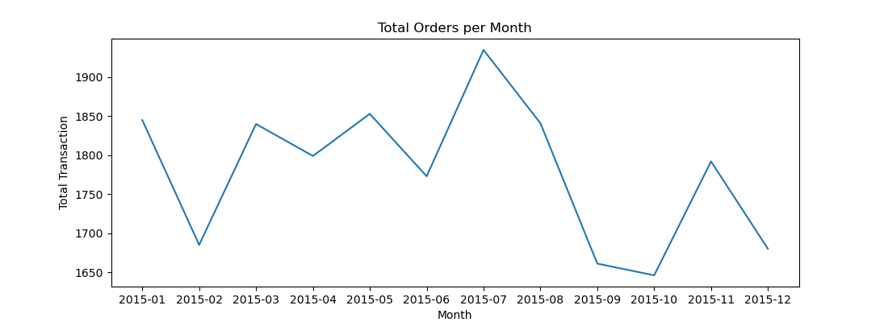
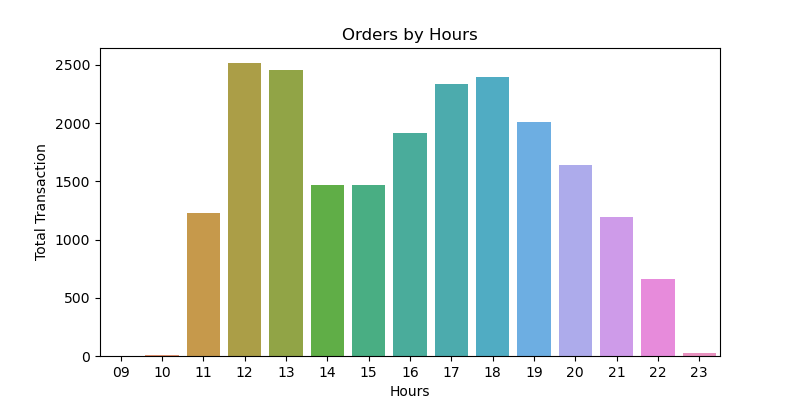
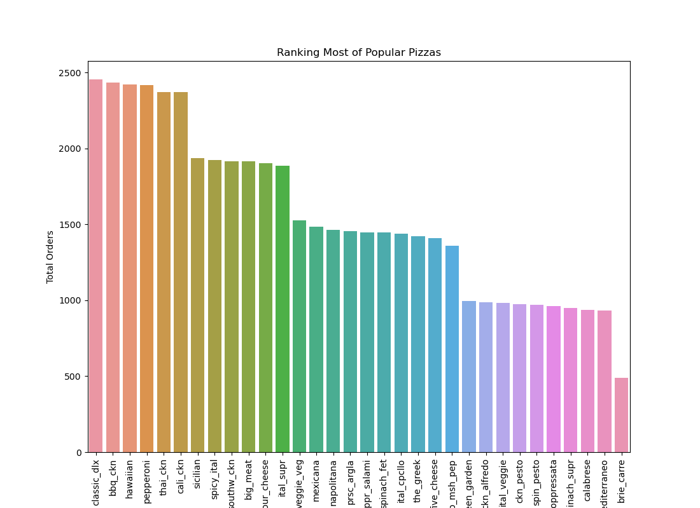

 <a href="https://achmadirfana.github.io/portofolio/portfolio-pizza-place.html">Back</a>

<h2>  Pizza Places</h2>

 URL Dashoboard project : <a href="https://pizza-places.onrender.com/">Pizza Places</a>

<h3> Background Project :</h3>

 work as an analyst for the Pizza Place restaurant. My boss asked you to analyze the restaurant's performance in 2015 

<h3>Purpose:</h3>

  The main purpose is to provide a number of isnight and recomendation about the data. To do this,
first I  need to identify the following data:

•  How many orders do we get each month? What month have the highest sales? Display in the form of a line chart. 

•  Are there peak hours? Display in bar plot form. 

•  What's the most ordered pizza? Compare order quantities on each type of pizza with a bar plot  

•  What is the revenue contribution for each pizza size? Show in the form of a pie chart

•  How is the revenue contribution for each type of pizza? Display in the form of bar plots, sorted from the highest contribution.

•  What is the revenue in every month 

<h3>Datas:</h3>
<h4>Dataset:</h4>

In this project, it used 3 csv files, orders, order_details, and pizzas, that can be accessed in the following link:

 <a href="https://drive.google.com/file/d/1Kfsd39u3bQujcwm6qDGvidlH5Lqc8wiJ/view?usp=share_link">orders</a>
 

 <a href="https://drive.google.com/file/d/1arl5qCDzmMLRTK9WMQmDCthgWZELrEQD/view?usp=share_link">order_details</a>
 

 <a href="https://drive.google.com/file/d/1FCHb0csgSgaal3sMgVCMu4PS-eb5qYBg/view?usp=share_link">pizzas</a>
 

each file is data from 2015 and must be imported to jupyter notebook

<h3>Data Preparation</h3>

 All files must be put in the same folder/directory as python 

<h4>Data Validation</h4>

 All the data must be checked whetever there is a abnormal data. The  queery for data checking and validating :

	
 

  
import pandas as pd 

import seaborn as sns 

import matplotlib.pyplot as plt 

import calendar 

order= pd.read_csv("orders.csv") 

order_detail= pd.read_csv("order_details.csv") 

pizzas= pd.read_csv("pizzas.csv") 

order_detail.isnull().any() #Checking data blank in file order_detail 

pizzas.isnull().any() #Checking data blank in file pizzas 

 

<h4>Data Duplicate Checking</h4>

 Code for data duplicate checking :

	
 

  
order.duplicated('order_id').any() #Checking whetevr any duplicate data in data order column order_id 

 
<h3>Dat Analyze</h3>
<h4>1. Total Order per Month</h4>

 Code: 

	
 

order['date']=pd.to_datetime(order['date']) 

order['month']=order['date'].dt.strftime("%Y-%m") 

plt.figure(figsize=(11,4)) 

sns.lineplot(data=order.groupby('month')['order_id'].count().reset_index(),x='month',y='order_id') 

plt.title('Total Orders per Month') 

plt.ylabel('Total Transaction') 

plt.xlabel('Month') 

plt.show 

 Output: 

 
  

<h4>2. Total Order per Hours</h4>

 Code: 

	
 

order['time']=pd.to_datetime(order['time']) 

order['hours']=order['time'].dt.strftime("%H") 

order_hour= order.groupby('hours')['order_id'].count().reset_index() 

order_hour.to_csv('order_hour.csv',index=False) 

plt.figure(figsize=(8,4)) 

sns.barplot(data=order_hour, x='hours', y='order_id') 

plt.title('Orders by Hours') 

plt.xlabel('Hours') 

plt.ylabel('Total Transaction') 

plt.show 

 Output: 

 
  

<h4>3. Ranking Most of Popular Pizzas</h4>

 Code: 

	
 

data_merge = pd.merge(order_detail,pizzas,on='pizza_id') 

data_merge_quantity= data_merge.groupby('pizza_type_id')['quantity'].sum().reset_index() 

data_merge_quantity.to_csv('data_merge_quantity.csv',index=False) 

plt.figure(figsize=(11,8)) 

plt.xticks(rotation='vertical') 

sns.barplot(data=data_merge_quantity.sort_values('quantity', ascending=False),x='pizza_type_id',y='quantity') 

plt.title('Ranking Most of Popular Pizzas') 

plt.xlabel('Pizza Type') 

plt.ylabel('Total Orders') 

plt.show 

 Output: 

 
  

